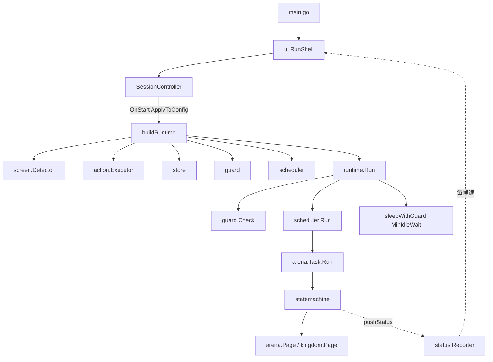
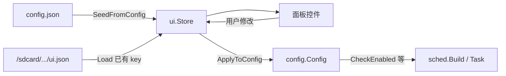

# 帅宾 Cookie 开发手册

面向本仓库（AutoGo + Go）的日常开发说明。架构以「调度器 + 任务级状态机」为核心，已按方案 A 做过保守精简。

---

## 1. 项目是什么

Android 游戏自动化脚本：编译为原生二进制或 APK，在设备上跑。


| 项    | 说明                                                                    |
| ---- | --------------------------------------------------------------------- |
| 模块名  | `app`（`go.mod`）                                                       |
| SDK  | 本地 `./AutoGo`，`replace github.com/Dasongzi1366/AutoGo => ./AutoGo`    |
| 目标平台 | Android（`.vscode/settings.json` → `AutoGo.targetPlatform: "android"`） |
| 当前业务 | 王国竞技场（`internal/game/arena`）                                          |


真机部署依赖 **AutoGo JetBrains 插件**（GoLand / IDEA）：连设备后用插件运行（默认 **F7**），或打 APK/二进制。

打包选项见 `[resources/META-INF/Android.toml](../resources/META-INF/Android.toml)`（`appPackage`、`appName`、`autoRun`、`showFloatingBall`）。

---


## 2. 架构总览




主循环（`internal/runtime`）：

1. `guard.Check()` — 处理已注册弹窗陷阱（竞技场弹窗由 `arena.NewTask` 的 `registerDialogTraps` 注册；未取色的自动跳过）
2. `scheduler.Run()` — 按注册顺序跑就绪任务
3. 无任务时：`MinIdleWait()` 取最短等待（最早可能就绪的任务，来自 `CheckReady` 的 remain），封顶 `IdleDelay`；否则睡 `IdleDelay`
4. 有任务时：睡 `StepDelay`

`SessionController.Stop` 会关闭 runtime stop 信号；状态机在 tick / sleep 边界检查 `ShouldStop`，并在旧 `Run` 退出前保持非 Idle，避免双 Runtime 并发点屏。

**不要**再引入全局 bot 状态机；页面流程放在各模块自己的 `statemachine` 里。

---


## 3. 目录与职责

```
.
├── main.go                 # 入口：配置 → ui.RunShell → SessionController → buildRuntime
├── config.json             # 用户配置（目前仅 modules.arena）
├── internal/
│   ├── config/             # Config 类型 + LoadConfig
│   ├── runtime/            # 大循环 + Pause/Resume/Stop
│   ├── scheduler/          # 任务轮询 + TaskOpts.Build
│   ├── statemachine/       # Keep / Retry / Next / Done / Fatal（支持 ShouldStop）
│   ├── status/             # 任务状态一行文本上报：任务 goroutine 写，灵动岛读
│   ├── guard/              # 弹窗陷阱（按优先级 Check）
│   ├── logger/             # 分级日志
│   ├── store/              # 业务 JSON KV（如免费刷新时间；路径见 ui.DefaultStorePath）
│   ├── platform/
│   │   ├── screen/         # Detector 接口 + Android 实现 / 桌面 stub
│   │   └── action/         # Executor 接口 + 坐标缩放 + Android 实现 / stub
│   ├── game/
│   │   ├── arena/          # 竞技场模块
│   │   └── common/kingdom/ # 王国首页/冒险页共享 Page
│   └── ui/                 # ImGui 壳：灵动岛悬浮窗 + 配置面板（android&&cgo）/ 桌面 stub
├── AutoGo/                 # SDK
├── resources/              # APK 资源
└── docs/                   # 文档（含本手册、API、设计稿）
```

已删除（勿再加回空壳）：`internal/dialog`、`internal/hud`、`internal/utils`。状态展示直接用 `logger`。

---


## 4. 本地开发命令

在 Windows 上可直接跑（平台调用走 stub）：

```bash
go test ./...
go test ./internal/game/arena/... -v
go test ./internal/statemachine -run TestMachineNextTransition

go build ./...

# android&&cgo 真机文件只能用插件 NDK 工具链编译，本机无法类型检查；
# 最接近的本机检查（cgo 关闭，仍走 stub 路径）：
GOOS=android GOARCH=arm64 CGO_ENABLED=0 go build ./...

gofmt -w <你改过的文件>   # 本仓库 core.autocrlf=true，勿 gofmt -w . 全量跑（会产生大面积伪 diff）
gofmt -l .
go vet ./...
go mod tidy
```

单元测试**不**验证真机截图/触控，只验证调度、状态机、坐标缩放与装配逻辑。

---


## 5. 入口装配约定（main.go）

推荐顺序：

1. `config.LoadConfig("config.json")`
2. `ui.NewStore` + `SeedFromConfig`；`status.New()` 创建任务状态上报通道；`ui.RunShell`（灵动岛 + 面板，`ShellOptions.Status` 传入该通道）
3. 用户点运行 → `SessionController.Start` → `ApplyToConfig` → `buildRuntime(cfg, statusReporter)`
4. `buildRuntime` 内：
  - `screen.NewDetector` / `action.NewExecutor`
  - `store.New(ui.DefaultStorePath)` / `guard.New` / `scheduler.New`
  - 构造模块 Page / Session / Task（`NewTask` 会顺带把弹窗特征注册进 Guard）
  - `sched.Build(TaskOpts{...})`**（可多次）**
  - `runtime.New(...)`，`arenaTask.SetShouldStop(rt.IsStopped)` + `SetStatusReporter(statusReporter)`，返回 `rt`
5. Controller 在 goroutine 中调用 `rt.Run()`

不要使用已删除的 `runtime.Register`；任务必须在 `Run()` 之前注册完毕。UI 入口只用 `RunShell`（无兼容壳）。

> 命名对照：`internal/ui.Store`（面板控件状态 → `ui.json`）≠ `internal/store.Store`（业务 KV → `store.json`）。
> 设备路径常量集中在 `internal/ui/options.go`：`DefaultDataDir` / `DefaultConfigPath` / `DefaultStorePath`，不要在别处硬编码 `/sdcard/...`。

---


## 6. 如何新增一个游戏模块

以「收集资源」为例，步骤如下。

### 6.1 建包

```
internal/game/collect/
  feature.go      # 比色/OCR/区域等 UI 特征（基准分辨率 1600×900）
  page.go         # 页面检测与点击
  route.go        # 进入/离开（可选）
  session.go      # 运行时状态 + store 持久化（可选）
  task.go         # NewTask + Run → 驱动状态机
  statemachine.go # handlers 映射
  *_test.go
```

共享导航放在 `internal/game/common/...`，不要复制粘贴进每个模块。

### 6.1.1 模块 Feature 约定

`feature.go` 只存 UI 常量（比色 / 坐标 / OCR 区），行为写在 `page.go`。

组织规则：

1. **顶层** = 真实页面（如 `Lobby`、`TeamSelect`）+ 可选 **`Dialogs`**（浮层，供 page / guard 共用）
2. **页内槽位**（有则写，无则省略）：
   - `Identify` — 页面识别
   - `Actions` — 点击 / 滑动目标
   - `Reads` — OCR / 读数区域
   - 可选：`Opponent`、`Gestures`、`Items` 等页面特有结构
3. **不要**按「所有按钮一堆、所有 OCR 一堆」做顶层分类
4. 访问路径示例：`feature.Lobby.Actions.FreeRefresh`、`feature.Lobby.Reads.Trophy`、`feature.Dialogs.MissingTopping`

范例见 `internal/game/arena/feature.go`；完整设计见 `docs/superpowers/specs/2026-07-09-arena-feature-layout-design.md`。

### 6.2 实现 Task

- `Run() error` 内 `statemachine.New()` → `Init` → 注册 handlers → `Run`
- 需要弹窗打断时，把 `guard.Check` 赋给 `statemachine.RunOptions.Guard`
- 页面依赖用小接口（见 `arena/task.go` 的 `page` / `route`），便于单测注入 mock

状态机结果语义：


| 结果             | 含义          |
| -------------- | ----------- |
| `Keep{}`       | 停留当前态       |
| `Retry{}`      | 重试当前态（计入重试） |
| `Next("name")` | 切到下一态       |
| `Done{}`       | 任务正常结束      |
| `Fatal{Err}`   | 致命错误        |

经验法则：**识别类失败（OCR 抖动、页面未及时出现）用 `Retry`，确认的业务异常才用 `Fatal`**。例如战斗结果识别失败应 `Retry`（见 `arena/statemachine.go` 的 `battle`），而不是当战败终止整轮。


### 6.3 配置（config.json）

在 `internal/config/static.go` 增加模块字段，例如：

```go
type Collect struct {
    Enabled bool `json:"enabled"`
    // 需要用户可调的参数继续往这里加
}

type ModuleConfig struct {
    Arena   Arena   `json:"arena"`
    Collect Collect `json:"collect"`
}
```

同步改：

- `DefaultConfig()` 默认值
- 根目录 `config.json` 示例结构
- `config_test.go` 覆盖新字段的加载/默认值

**没有实现的模块不要加配置字段。**

### 6.4 UI 配置面板（必做，与 config 同步）

用户在 Android 上改选项走这条链，缺一环就会「面板改了不生效」或「重启丢设置」：



`main.go` 已固定装配顺序，新模块只需扩展 binding 与面板，不必改生命周期：

1. `LoadConfig("config.json")`
2. `ui.SeedFromConfig(store, cfg)` — 仅填充 Store 里**尚不存在**的 key（设备上已有 `ui.json` 时以面板存档优先）
3. 用户在面板改控件 → 写回 `Store`
4. 点「运行脚本」→ `ui.ApplyToConfig(store, cfg)` → `buildRuntime(cfg, statusReporter)` → `rt.Run()`

#### 6.4.1 在 `binding.go` 增加 key 与双向映射

文件：[`internal/ui/binding.go`](../internal/ui/binding.go)

1. 增加常量（建议 `模块_字段` 小写蛇形，与竞技场一致）：

```go
const (
    // 已有 arena_* ...
    KeyCollectEnabled = "collect_enabled"
)
```

2. `SeedFromConfig`：从 `cfg` 写入默认值（用 `seedBool` / `seedFloat`，避免覆盖用户已存 key）：

```go
seedBool(store, KeyCollectEnabled, cfg.Modules.Collect.Enabled)
```

3. `ApplyToConfig`：从 Store 写回 `cfg`（运行前必须能读到最新值）：

```go
cfg.Modules.Collect.Enabled = store.GetBool(KeyCollectEnabled)
```

类型约定：

| config 字段类型 | Store API | 常用控件 |
|---|---|---|
| `bool` | `GetBool` / `SetBool` | `UI_创建复选框` |
| `int` / `float` | `GetFloat` / `SetFloat` | `UI_创建数字输入框` |
| `*int`（可选上限，0/空表示不限） | `GetFloat`，Apply 时 `>0` 才取地址 | `UI_创建数字输入框`（参考 `MaxBattles`） |
| `string` | `GetString` / `SetString` | `UI_创建输入框` / `UI_创建下拉框` |

#### 6.4.2 在 `cookie_panel_android.go` 增加控件

文件：[`internal/ui/cookie_panel_android.go`](../internal/ui/cookie_panel_android.go)（`//go:build android && cgo`）

面板是「分类 + 列表 + 详情」：模块写在编译期静态表 [`BuiltinModules`](../internal/ui/modules.go)，**不要**再引入全局 `RegisterModule` 注册表。新模块两步：

1. 在 `BuiltinModules()` 追加一项（`ID` / `Title` / `Category` / `EnabledKey`）。
2. 在 `cookie_panel_android.go` 的 `renderModuleDetail` switch 里加详情控件（key 与 binding 一致）。

示例（详情分支）：

```go
case "collect":
    UI_创建复选框(store, KeyCollectEnabled, "启用收集资源")
```

常用控件（定义在 `widgets_android.go`，优先复用）：

| 控件 | 用途 |
|---|---|
| `UI_创建复选框(store, key, 显示名)` | 开关 |
| `UI_创建数字输入框(store, key, 显示名, hint, width, ...)` | 数值 |
| `UI_创建输入框` | 文本 |

注意：

- 控件的 `key` **必须**与 `binding.go` 常量一致，否则 Seed/Apply 对不上。
- 用户选项落盘路径默认 `ui.DefaultConfigPath`（`/sdcard/shuaibin-cookie/ui.json`）。这是 UI Store 存档，与项目根目录 `config.json` 不同：前者偏设备上的面板状态，后者偏仓库默认/文档化配置。业务 KV（如竞技场刷新时间）另存 `ui.DefaultStorePath`（`/sdcard/shuaibin-cookie/store.json`）。
- 桌面 `panel_stub` 会跳过面板直接走 `SessionController.Start()`，不渲染这些控件。
- 未实现的模块不要进 `BuiltinModules` / 面板。

#### 6.4.3 UI 改完后的自检

- [ ] `binding` 常量、`SeedFromConfig`、`ApplyToConfig`、面板控件四处 key 一致
- [ ] `CheckEnabled`（或任务逻辑）读的是 `cfg.Modules.Xxx`，且发生在 `ApplyToConfig` 之后（`SessionController.OnStart` 已保证）
- [ ] 可选指针字段（如「0=不限」）的 Apply 语义与面板 hint 一致
- [ ] 未实现的模块没有出现在面板上

### 6.5 注册到调度器

在 `main.go` 的 `buildRuntime` 里、`rt.Run()` 之前：

```go
sched.Build(scheduler.TaskOpts{
    Name: "收集资源",
    CheckEnabled: func() bool { return cfg.Modules.Collect },
    CheckReady: func() (bool, time.Duration) {
        // ready=false 且 remain>0 → runtime 会按 remain 空闲等待（封顶 IdleDelay）
        return true, 0
    },
    WaitHUD: func(remain time.Duration) string { return "收集冷却" },
    Action:  collectTask.Run,
})
```

`TaskOpts` 仅保留这些字段：


| 字段             | 作用                        |
| -------------- | ------------------------- |
| `Name`         | 任务名（也是 idle provider 名）   |
| `CheckEnabled` | 配置是否开启                    |
| `CheckReady`   | 是否可跑；返回 `(ready, remain)` |
| `WaitHUD`      | 等待文案（日志 / idle label）     |
| `Action`       | 实际执行，通常是 `task.Run`       |


`Build` 在提供 `CheckReady` 时会**自动** `AddIdleProvider`，无需手写。

调度顺序 = `Build` 调用顺序。更紧急的任务先注册。

可选：要让灵动岛显示任务状态（战斗次数/胜率等一行文本），在 `buildRuntime` 里 `task.SetStatusReporter(statusReporter)` 并在状态机循环节点推文本（见 §9.2「任务状态上岛」）。

---


## 7. 平台层用法


### 7.1 屏幕识别（`platform/screen`）

```go
det := screen.NewDetector(0) // displayId，一般 0
det.MatchColor(x, y, color, sim)
det.FindColor(region, color, sim, dir)
det.MatchMultiColor(colors, sim)
det.MatchImage(region, template, sim)
text, err := det.OCRText(region) // err≠nil=识别通道故障（截屏/引擎失败）；""+nil=屏幕上无文字
```

- Android（`android && cgo`）：真实现（`color.go` / `image.go` / `ocr.go`）
- 桌面：`factory.go` stub，全部返回 false / 空，保证 `go test` 能过
- OCR 引擎（ppocr）在 `ocr.go` 内进程级共享复用（`New` 会加载模型，成本高）；业务代码**不要**自行 `ppocr.New`。
- 比色类接口（`MatchColor` 等）SDK 只返 bool、无 error 通道：「未命中」与「比色异常」不可区分，写识别逻辑时注意这一点。


### 7.2 触控（`platform/action`）

```go
exec := action.NewExecutor(0)
exec.Tap(action.Point{X: 1335, Y: 814})
exec.Swipe(from, to, 300)
exec.Back() / Home() / Sleep(ms)
```

坐标约定：

- 业务代码写 **1600×900** 基准坐标
- `SafeTap` / Android `Tap` 内部会 `Scale` + `Bound` 到实际分辨率
- `action.Point` / `action.Region` 是 `screen.Point` / `screen.Region` 的**别名**：识别层输出的坐标/区域可直接传给执行层，无需类型转换；按钮目标优先用 `Region` + `action.RandomIn` 框内随机点
- 触控**不返回 error**：取不到显示信息（多为设备掉线）时实现侧打 `[Action]` 告警并跳过本次动作；页面异常由识别层在下一轮自然发现


### 7.3 新增平台能力时

1. 先扩接口（`detector.go` / `executor.go`）
2. 再写 Android 实现文件（带 build tag）
3. stub factory 补空实现
4. 业务只依赖接口，方便 mock

---


## 8. Guard（弹窗）

```go
g := guard.New(det)
g.Register("某弹窗", screen.Feature{Colors: "...", Sim: 0.9}, func() error {
    // 点确认 / 关闭
    return nil
}, 10) // priority 越大越先匹配
```

- `feature`：`screen.Feature{Colors, Sim}`；`Colors` 为空（未取色）直接跳过注册并告警，`Sim <= 0` 回落 0.9
- runtime 每轮主循环与其 `sleepWithGuard` 分段 sleep 中都会 `Check`；任务状态机挂 `opts.Guard = g.Check` 后，tick 与其分段 sleep 也会 `Check`

竞技场弹窗在 `arena.NewTask` 的 `registerDialogTraps` 注册（特征来自 `Feature.Dialogs`，未取色的弹窗自动跳过）。新增弹窗：在 `DialogsFeature` 加 `DialogDef` 并在 `registerDialogTraps` 的表里加一行。

---


## 9. 配置与 UI


### 9.1 config.json

当前形态：

```json
{
  "modules": {
    "arena": {
      "enabled": true,
      "maxBattles": null,
      "autoBuyCount": 0,
      "trophyDiff": 0
    }
  }
}
```

缺文件时 `LoadConfig` 回退 `DefaultConfig()`。稳定 UI 常量（坐标、比色）放模块代码，不进 JSON。

### 9.2 UI 壳（灵动岛 + 面板）

- 面板为 **QQ 蓝主题**（[`internal/ui/theme_android.go`](../internal/ui/theme_android.go)，`ApplyQQBlueTheme`）：浅蓝窗体 + 白色内容区 + 天蓝主色；窗口顶部是自绘的天蓝渐变标题栏（白标题 + 关闭圆钮，见 `panel_android.go` 的 `drawPanelTitleBar`），不用 ImGui 原生标题栏。改配色只动 `DefaultQQBlueTheme()`。
- 悬浮窗为**灵动岛**（[`internal/ui/island_android.go`](../internal/ui/island_android.go)）：顶部居中黑色胶囊，显示状态点 + `帅宾 Cookie · 状态`；点按展开圆角卡片（开始/停止、暂停/继续、设置、关闭四个苹果风格图标按钮），再点卡片空白处或卡片外任意处收起，展开约 6s 无操作自动收起；固定顶部居中，**不可拖动**。回调走 `IslandCallbacks`，与原悬浮球一致。
- **悬浮窗会被截图一起截进去**（CaptureScreen 是全屏合成画面，UI 无法从中剔除），因此遮挡策略是"被遮时不识别"：打开配置面板时若脚本运行中会**自动暂停**、关面板后自动恢复（`shell_android.go` 的 `autoPaused`）；识别/取色区域（feature.go）必须避开灵动岛占据的顶部中央条带（1600 基准约 y≤80，展开卡片约 y≤210、x≈520–1080）。
- **任务状态上岛**：模块把一行状态文本写进 `internal/status.Reporter`（任务 goroutine 写、UI 每帧读，线程安全；空串回退默认文案）。竞技场在状态机 `sync` 节点调用 `Task.pushStatus`（文案由 `Session.StatusText` 生成：`竞技场 3/10 · 胜率 50%`）；`main.go` 创建唯一实例，同时传给 `ShellOptions.Status` 与 `Task.SetStatusReporter`。仅 **运行中** 展示任务状态，暂停/空闲回退 `帅宾 Cookie · 状态`。新模块要上报：调 `SetStatusReporter` 并在循环节点推文本即可。
- Android：`internal/ui` ImGui 面板，配置落盘路径默认 `ui.DefaultConfigPath`
- 非 Android：`panel_stub.go` 直接 `Controller.Start()`（无面板渲染），方便本地联调装配

新增模块时的完整 UI 步骤见 **§6.4**（binding key → Seed/Apply → `cookie_panel_android.go` 控件 → 自检）。通用控件在 `widgets_android.go`，优先复用，勿复制一套。

---


## 10. Store 持久化

```go
s := store.New("data/store.json")
s.Set("key", value)
s.GetInt64("key")
```

用于跨轮次状态（如竞技场下次免费刷新时间）。不要把大对象或截图塞进 store。

---


## 11. 日志

```go
logger.SetLevel(logger.LevelInfo) // Debug / Info / Warn / Error
logger.Infof("[Arena] sync tickets=%d", n)
```

前缀建议带模块名：`[Runtime]`、`[Scheduler]`、`[Arena]`、`[Guard]`、`[Action]`。

---


## 12. 测试约定


| 层级                                  | 怎么测                                                          |
| ----------------------------------- | ------------------------------------------------------------ |
| scheduler / runtime / guard / store | 包内单测，mock detector                                           |
| arena 状态机                           | `newTask` + mock `page`/`route`，`runWithOptions` 缩短 Interval |
| coord                               | 纯函数测 Scale/Bound                                             |
| 真机路径                                | 插件部署，看 logcat / 脚本日志                                         |


新增模块至少覆盖：就绪/未就绪、主路径状态迁移、关键失败分支（无票、达上限等）。

---


## 13. 常见坑

1. **坐标未按 1600×900 写** — 多分辨率会偏。
2. `CheckReady` **返回 remain 但以为会立刻再跑** — 实际走 idle 等待，且封顶 `IdleDelay`（默认 30s）；长冷却会分段醒过来重新算。
3. **在** `Run()` **之后才 Build 任务** — 不会进调度。
4. **把平台调用写进无 build tag 的文件** — Windows `go test` 会挂；放进 `*_android.go` 或经接口调用。
5. **为未实现模块加 config/UI** — 已明确禁止；实现后再加。
6. **只改了面板控件、没改 binding** — 运行时 `ApplyToConfig` 写不回 `cfg`，开关无效；四处 key 必须一致（§6.4）。
7. **把 `OCRText` 的 error 当空文本（或反之）** — `err≠nil` 是截屏/引擎故障，`""+nil` 才是屏幕上无文字；前者该告警重试，后者是正常的"没读到"。
8. **注册 `Colors` 为空的 trap** — Guard 会直接跳过并告警，等于没注册；弹窗特征先取色再 `Register`。
9. **指望 Executor 返回错误** — 触控接口无 error 返回；设备掉线看 `[Action]` 告警日志，流程异常靠识别层兜底。
10. **文档漂移** — 以本手册与 `CLAUDE.md` / `AGENTS.md` 为准；旧 bot 设计稿仅作历史参考。
11. **识别区域画进灵动岛条带** — 悬浮窗会被截图一起截进去；feature 取色/OCR 区域避开顶部中央（1600 基准 y≤80，展开卡片 y≤210），开面板会遮挡全屏，脚本此时已被自动暂停（§9.2）。

---

## 14. 参考文档

| 文档 | 用途 |
|---|---|
| [`docs/autogo-doc文档2026.6.6.md`](./autogo-doc文档2026.6.6.md) | AutoGo SDK API |
| [`docs/superpowers/specs/2026-07-08-arena-module-design.md`](./superpowers/specs/2026-07-08-arena-module-design.md) | 竞技场与分层设计（部分细节已精简，以代码为准） |
| [`docs/superpowers/specs/2026-07-09-architecture-simplify-design.md`](./superpowers/specs/2026-07-09-architecture-simplify-design.md) | 架构精简说明 |
| [`CLAUDE.md`](../CLAUDE.md) / [`AGENTS.md`](../AGENTS.md) | Agent 用项目指南（与本手册一致） |

---

## 15. 最小检查清单（提 PR / 交活前）

- [ ] `gofmt` 干净（只格式化改过的文件）
- [ ] `go test ./...` 通过
- [ ] `go build ./...` 通过
- [ ] 新模块已 `sched.Build`，且顺序合理
- [ ] 有 `CheckReady` 时确认 idle 等待符合预期
- [ ] config / UI binding / 面板控件 / `DefaultConfig` 四处字段与 key 一致（见 §6.4.3）
- [ ] 未引入无消费者的空壳包或死开关
